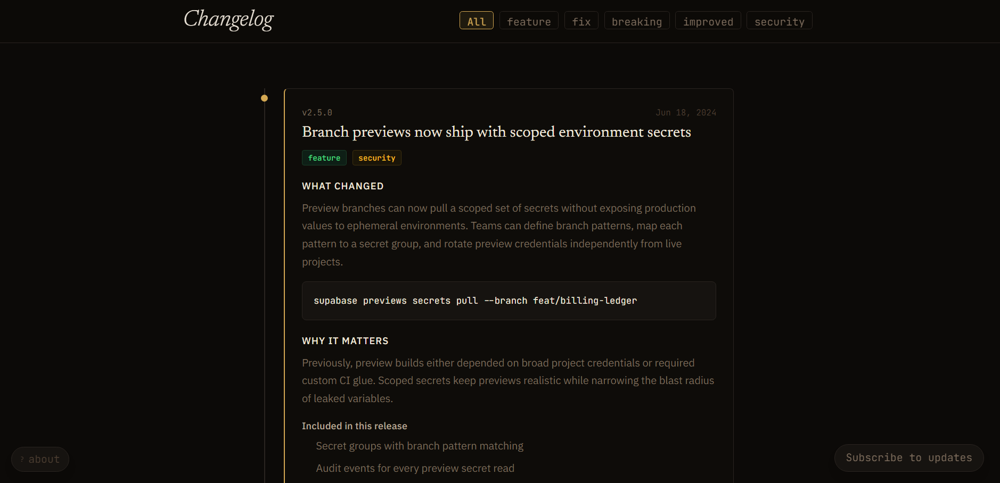

# Changelog Studio

An editorial changelog **reader** and a release-notes **generator** in one. The feed
publishes releases; the studio writes them.

[Live demo →](https://changelog.javiertpadilla.com/)



## What it does

**The feed** is a production changelog: URL-synced tag filters, instant search,
keyboard navigation, a reading-progress rail, and a release-cadence chart. MDX
entries are compiled on the server and handed to the client as a slot, so
`next-mdx-remote` never reaches the browser bundle.

**The studio** (`/studio`) turns raw developer output into publishable notes:

- **Parses** `git log --oneline`, full `git log`, conventional commits, or plain
  sentences. Scopes, SHAs, PR refs, and `!` breaking markers are all recognised;
  housekeeping commits (`chore`, `ci`, `build`, `test`) are parsed but left
  unchecked rather than silently dropped.
- **Infers the semver bump** from what the set actually contains - a breaking
  change forces major, anything additive forces minor - and shows the resulting
  version for all three options with the reasoning spelled out.
- **Writes in four voices.** The same commits, aimed at different readers:
  *Engineering* keeps scopes and SHAs; *Product* expands jargon, strips internal
  refs, and moves imperative commit mood into third person; *Design* leads with
  interface and accessibility work; *Summary* caps each section at three lines.
- **Exports seven formats**: Keep a Changelog Markdown, MDX with frontmatter, a
  ready-to-paste `entries.ts` object, JSON, inline-styled HTML for email, Slack
  mrkdwn, and plain text. Copy or download any of them.
- Everything runs in the browser. No API, no key, no upload. Drafts autosave to
  `localStorage`.

The live preview renders through the **same components and CSS as the published
feed**, so the entry you see is the entry you get.

## Design notes

The concept is *the press room*: a changelog is a publication, so this one is set
like one.

- **Type** - Fraunces carries the editorial voice; its optical-size axis lets one
  family set a 116px masthead and a 22px entry title without either looking
  stretched. IBM Plex Sans reads the prose, JetBrains Mono holds every number,
  tag, and key.
- **Two stocks, not one inverted** - *ink* is a warm near-black with gold foil;
  *newsprint* is a paper white with a darker, higher-contrast gold. Tag colours
  are redefined per theme rather than reused, so nothing drops below contrast in
  the light view.
- **Texture** - a fixed SVG grain layer and a soft vignette in overlay blend mode.
  The difference between a screen and a printed surface, for one element.
- **State** - tag filters live in the URL so a filtered view is shareable, but
  filtering happens locally: the click and the result are the same frame. Theme
  and density are applied before first paint by an inline script, so a stored
  preference never flashes.
- **Motion** - one orchestrated page-load stagger, then scroll reveals from a
  single `IntersectionObserver` for the whole feed. Everything is capped around
  340ms and collapses under `prefers-reduced-motion`.
- **The cadence chart** is one series, so the brand gold carries the data, no
  legend restates the title, and every label stays in a text token. Empty months
  keep their slot - the gaps are the point. A visually-hidden table carries the
  same numbers.

## Keyboard

| Keys | Action |
| --- | --- |
| `⌘K` | Command bar - jump to a release, filter, or switch theme |
| `?` | Shortcuts sheet |
| `T` | Switch stock (ink ⇄ newsprint) |
| `G` `H` / `G` `S` | Go to the feed / the studio |
| `J` / `K` | Next / previous release |
| `/` | Search releases |
| `⌘↵` | Parse the source (studio) |
| `⌘S` | Copy the current export (studio) |

## Stack

Next.js 14 (App Router) · TypeScript · Tailwind CSS v4 · MDX · date-fns

No component library, no animation library, no state manager. The design system
lives in `app/globals.css` as tokens plus a `components` cascade layer, so
Tailwind utilities still override it where a one-off is warranted.

## Architecture

```
app/
  page.tsx            feed - compiles MDX, passes it to the client as a slot
  studio/page.tsx     the generator
  rss/route.ts        RSS 2.0 with full content
lib/
  parseCommits.ts     git log / conventional commits / prose -> ParsedItem[]
  semver.ts           bump inference and version arithmetic
  voice.ts            the four audience presets
  exporters.ts        one section tree -> seven output formats
  miniMarkdown.tsx    zero-dependency renderer for the live preview
```

Every exporter consumes the same section tree, so a change to the voice rules
propagates everywhere at once and the preview cannot drift from the output.

## Run locally

```bash
git clone https://github.com/mastercontrolJavi/changelog-ui
cd changelog-ui
npm install
npm run dev
```

Open [http://localhost:3000](http://localhost:3000).
